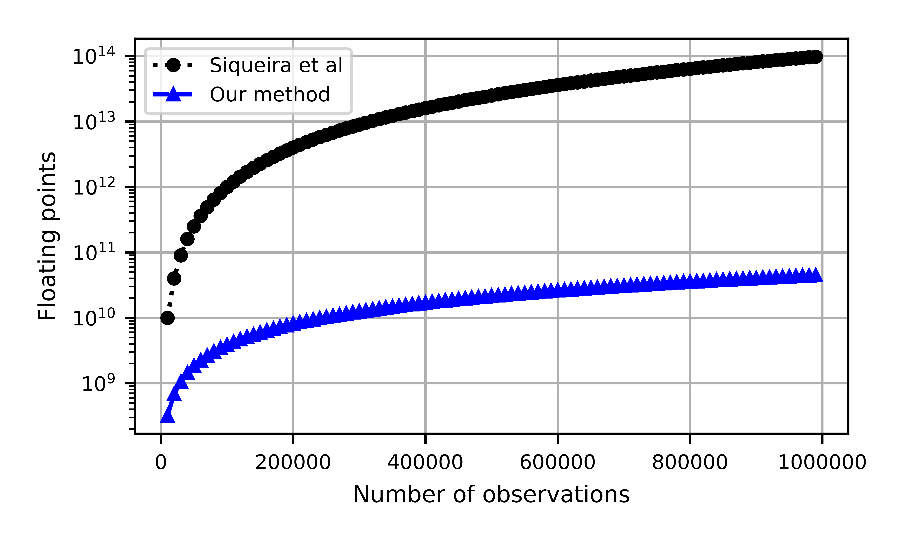
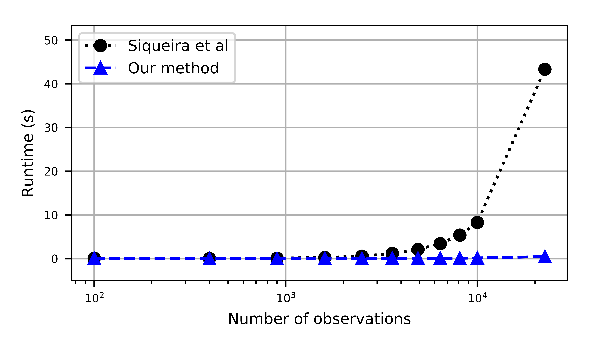
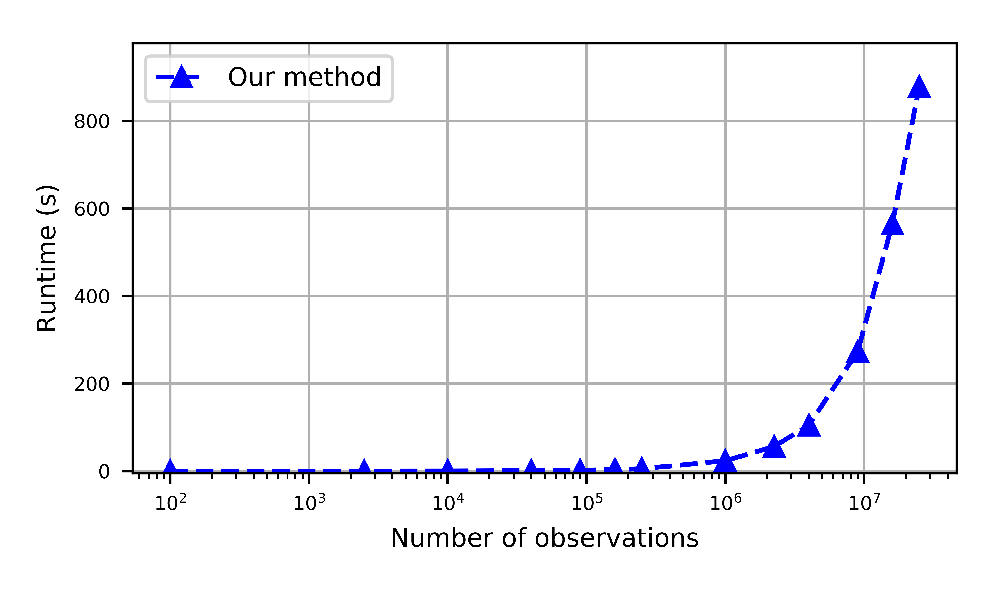

# Convolutional equivalent layer for gravity data processing

by
[Diego Takahashi](http://www.pinga-lab.org/people/tomazella.html)1,
[Vanderlei C. Oliveira Jr.](http://www.pinga-lab.org/people/oliveira-jr.html)1 and
[Valéria C. F. Barbosa](http://www.pinga-lab.org/people/oliveira-jr.html)1

1[Observatório Nacional](http://www.on.br/index.php/pt-br/)

This work was accepted for publication in
[*Geophysics*](https://seg.org/Publications/Journals/Geophysics).

## Abstract

We develop an efficient and very fast equivalent-layer technique for gravity data processing
by modifying an iterative method grounded on an excess mass constraint that does not
require the solution of linear systems. Taking advantage of the symmetric Block-Toeplitz
Toeplitz-Block (BTTB) structure of the sensitivity matrix, that arises when regular grids
of observation points and equivalent sources (point masses) are used to set up a fictitious
equivalent layer, we develop an algorithm that greatly reduces the computational complexity
and RAM memory necessary to estimate a 2D mass distribution over the equivalent layer.
The structure of symmetric BTTB matrix consists of the elements of the first column of
the sensitivity matrix, which in turn can be embedded into a symmetric Block-Circulant
Circulant-Block (BCCB) matrix. Likewise, only the first column of the BCCB matrix is
needed to reconstruct the full sensitivity matrix completely. From the first column of BCCB
matrix, its eigenvalues can be calculated using the 2D Fast Fourier Transform (2D FFT),
which can be used to readily compute the matrix-vector product of the forward modeling
in the fast equivalent-layer technique. As a result, our method is eficient for processing
1
very large datasets. Tests with synthetic data demonstrate the ability of our method to
satisfactorily upward- and downward-continuing gravity data. Our results show very small
border effects and noise amplification compared to those produced by the classical approach
in the Fourier domain. Besides, they show that while the running time of our method
is nearly 30.9 seconds for processing N = 1,000,000 observations, the fast equivalent-layer
technique spent approximately 46.8 seconds with N = 22,500. A test with field data from Carajás
Province, Brazil, illustrates the low computational cost of our method to process a large
data set composed of N = 250,000 observations.

**Figure 1:** *floating points to estimate the parameter vector using the fast equivalent 
layer with Siqueira et al.'s method and our approach versus the numbers of observation 
points varyig from N = 5,000 to N = 1,000,000 with 50 iterations. The number of operations 
is drastically decreased.*

**Figure 2:** *time necessary to run 50 iterations of the Siqueira et al.'s method and the 
one presented in this work. With the limitation of 16 Gb of memory RAM in our system, we 
chose to test only up to 22,500 obervation points.*

**Figure 3:** *time necessary to run 50 iterations of this method. We run up to 25,000,000 
observation points. The time to processes 1,000,000 observation points was approximately 30.9
seconds.*

## Reproducing the results

You can download a copy of all the files in this repository by cloning the
[git](https://git-scm.com/) repository:

    git clone https://github.com/pinga-lab/Eq_Layer-Toeplitz.git

All source code used to generate the results and figures in the paper are in
the `code` folder. The sources for the manuscript text and figures are in `manuscript`.
See the `README.md` files in each directory for a full description.

The calculations and figure generation are all run inside
[Jupyter notebooks](http://jupyter.org/).
You can view a static (non-executable) version of the notebooks in the
[nbviewer](https://nbviewer.jupyter.org/) webservice:

http://nbviewer.jupyter.org/github/pinga-lab/Eq_Layer-Toeplitz

See sections below for instructions on executing the code.

### Setting up your environment

You'll need a working Python **2.7** environment with all the standard
scientific packages installed (numpy, scipy, matplotlib, etc).  The easiest
(and recommended) way to get this is to download and install the
[Anaconda Python distribution](http://continuum.io/downloads#all).
Make sure you get the **Python 2.7** version.

Use `conda` package manager (included in Anaconda) to create a
[virtual environment](https://conda.io/docs/using/envs.html) with
all the required packages installed.
Run the following command in this folder (where `environment.yml`
is located):

    conda env create

To activate the conda environment, run

    source activate bttb

or, if you're on Windows,

    activate bttb

This will enable the environment for your current terminal session.
After running the code, deactivate the environment with the following
commands:

    source deactivate

or, if you're on Windows,

    deactivate

**Windows users:** We recommend having a bash shell and the `make` installed
to run the code, produce the results and check the code. You may download the
[*Git for Windows*](https://git-for-windows.github.io/) and the
[*Software Carpentry Windows Installer*](https://github.com/swcarpentry/windows-installer/releases).

### Running the code

To execute the code in the Jupyter notebooks, you must first start the
notebook server by going into the repository folder and running:

    jupyter notebook

Make sure you have the `conda` environment enabled first.

This will start the server and open your default web browser to the Jupyter
interface. In the page, go into the `code` folder and select the
notebook that you wish to view/run.

The notebook is divided into cells (some have text while other have code).
Each cell can be executed using `Shift + Enter`.
Executing text cells does nothing while executing code cells runs the code
and produces it's output.
To execute the whole notebook, run all cells in order or use "Cell -> Run All"
from the menu bar.

## License

All source code is made available under a BSD 3-clause license.  You can freely
use and modify the code, without warranty, so long as you provide attribution
to the authors.  See `LICENSE.md` for the full license text.

The manuscript text is not open source. The authors reserve the rights to the
article content.